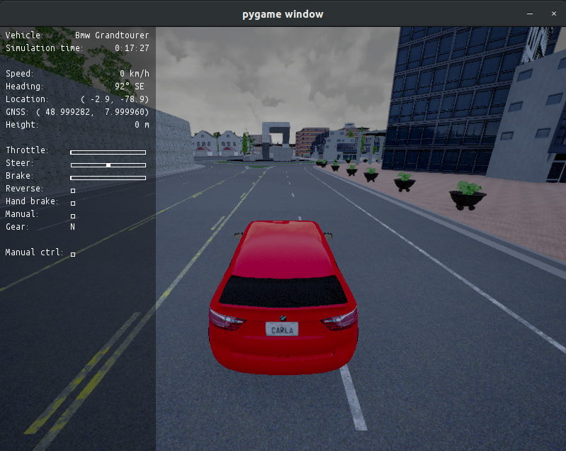
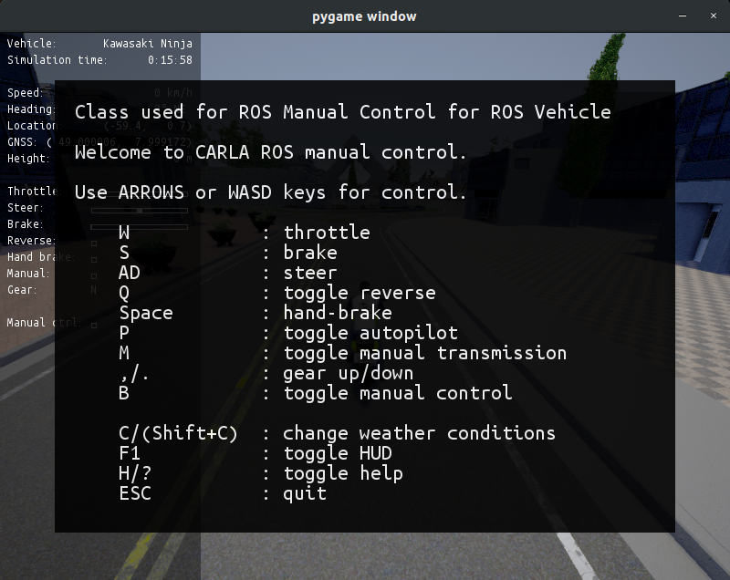

# Carla Manual Control

The node `carla_ros_manual_control` is a ROS-only version of the Carla `manual_control.py`. All data is received
via ROS topics.

## Prerequistes
To be able to use `carla_ros_manual_control`, some sensors need to be attached to the ego vehicle:
- to display an image: a camera with role-name 'view' and resolution 800x600
- to display the current gnss position: a gnss sensor with role-name 'gnss1'
- to get a notification on lane invasions: a lane invasion sensor
- to get a notification on lane invasions: a collision sensor

## Manual steering

In order to steer manually, you might need to disable sending vehicle control commands within another ROS node.

Therefore the manual control is able to publish to `/vehicle_control_manual_override` ([std_msgs/Bool](http://docs.ros.org/api/std_msgs/html/msg/Bool.html)).

Press `M` to toggle the value.

Notes: 
- As sending the vehicle control commands is highly dependent on your setup, you need to implement the subscriber to that topic yourself.
- The carla_ros_bridge package must be active in order to establish a connection with the CARLA server.

## Change Weather Conditions
It is possible to change the weather conditions in CARLA.

Press `C` to change the weather conditions.

## Help Text

To see all possible actions in the Pygame you can consult the help guide present in the Pygame.

Press `H` to open the help guide.
## Image Results

