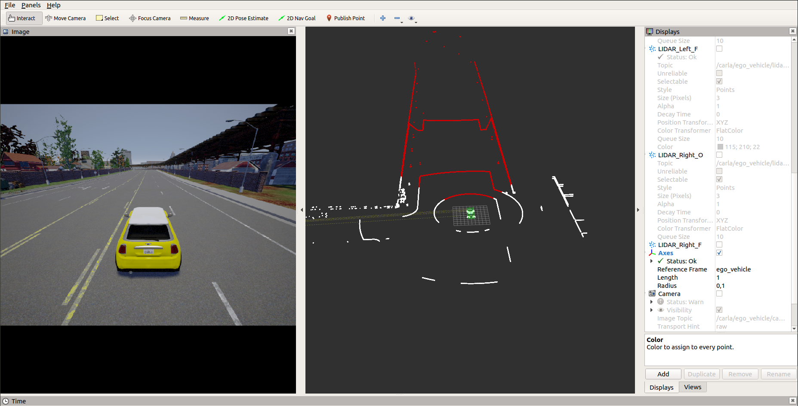
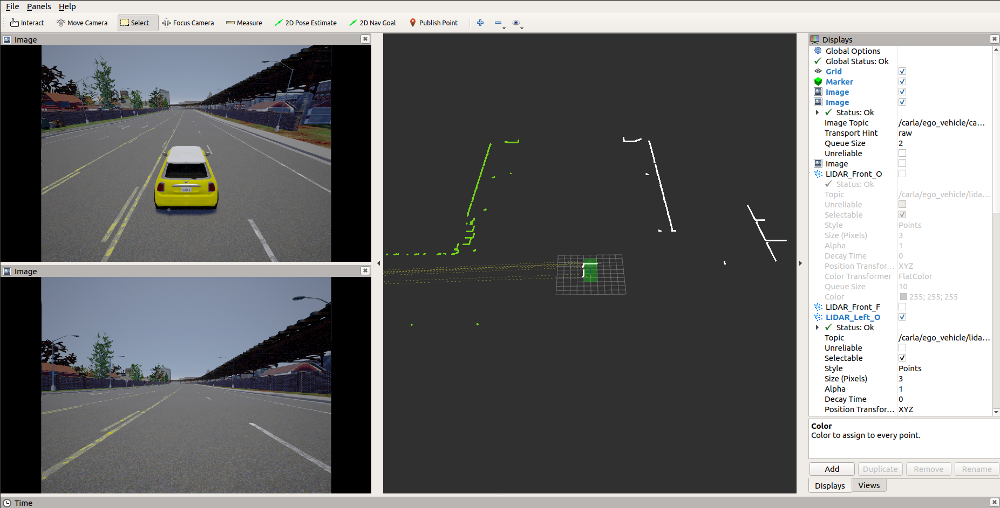
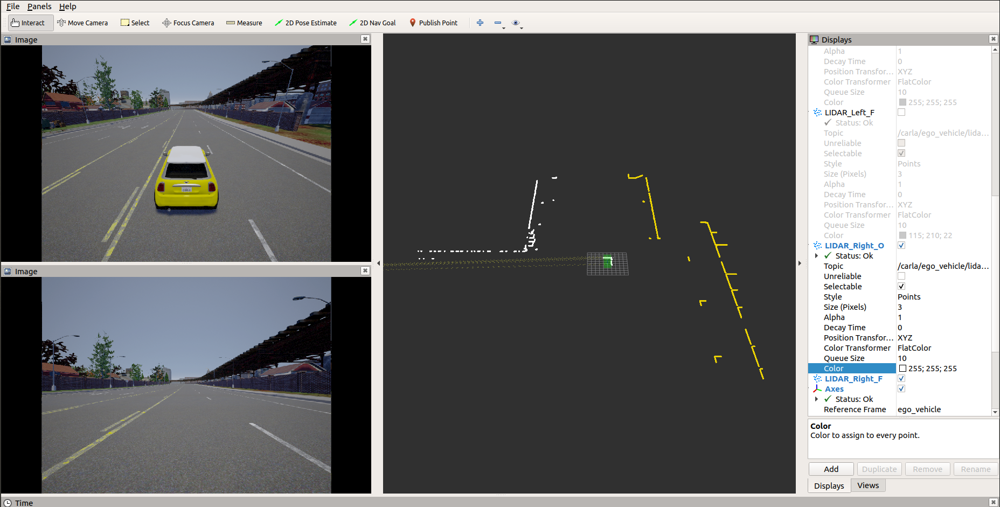
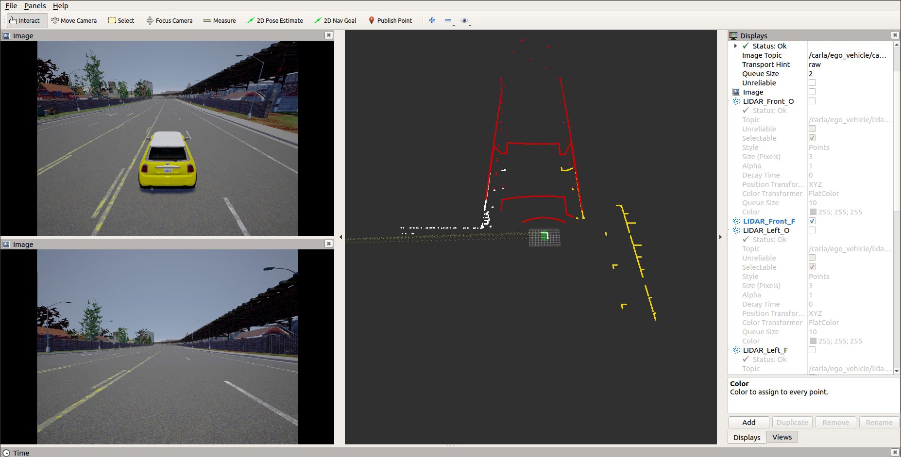
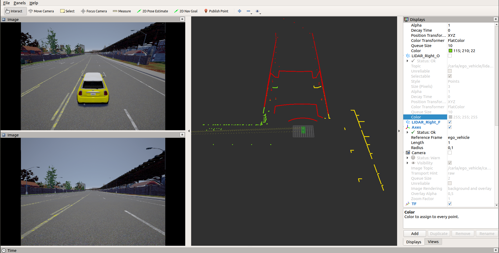

# CARLA-ROS Point Cloud Map Creation

The node `carla_ros_pcl_filter` is used to filter the pointcloud information from the LIDAR sensors to fit the LIDAR sensors of the ATLASCAR.

The point clouds are created by driving around with an ego vehicle, using the autopilot functionality within the Carla PythonAPI.

## Setup

See setup of carla-ros-bridge.

## Run

Execute the Carla Simulator and the Pcl-Filter.

    #Terminal 1

    #execute Carla
    SDL_VIDEODRIVER=offscreen <path-to-carla>/CarlaUE4.sh /Game/Carla/Maps/Town01 -benchmark -fps=20

    #Terminal 2

    #Execute the PCL Capturing
    #The captured point clouds are saved to /tmp/pcl_capture directory.
    export PYTHONPATH=<path-to-carla>/PythonAPI/carla/dist/carla-<version_and_arch>.egg:<path-to-carla>/PythonAPI/carla/
    source <path-to-catkin-workspace>/devel/setup.bash
    roslaunch carla_ros_pcl_filter pcl_filter.launch
    
    #Execute the PCL Capturing with client
    #The captured point clouds are saved to /tmp/pcl_capture directory.
    export PYTHONPATH=<path-to-carla>/PythonAPI/carla/dist/carla-<version_and_arch>.egg:<path-to-carla>/PythonAPI/carla/
    source <path-to-catkin-workspace>/devel/setup.bash
    roslaunch carla_ros_pcl_filter pcl_filter_with_client.launch

## Image Results with RVIZ

