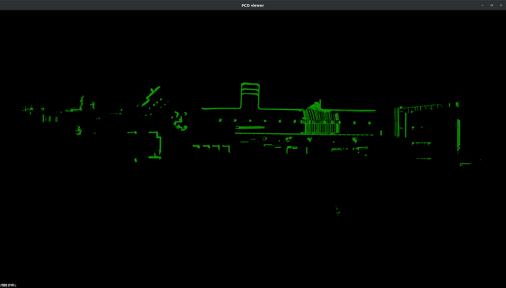

# CARLA-ROS Point Cloud Map Visualization

The node `carla_ros_pcl_visualizer` is used to create pointcloud maps for Carla levels.

The point clouds are created by driving around with an ego vehicle, using the autopilot functionality within the Carla PythonAPI.

## Setup

See setup of carla-ros-bridge.

## Run

Execute the Carla Simulator and the Pcl-Visualizer.

    #Terminal 1

    #execute Carla
    SDL_VIDEODRIVER=offscreen <path-to-carla>/CarlaUE4.sh /Game/Carla/Maps/Town01 -benchmark -fps=20

    #Terminal 2

    #Execute the PCL Capturing
    #The captured point clouds are saved to /tmp/pcl_capture directory.
    export PYTHONPATH=<path-to-carla>/PythonAPI/carla/dist/carla-<version_and_arch>.egg:<path-to-carla>/PythonAPI/carla/
    source <path-to-catkin-workspace>/devel/setup.bash
    roslaunch carla_ros_pcl_visualizer pcl_visualizer.launch

When the captured point clouds are all set and done, you can reduce the overall size of these point cloud and view the map result for each of them by running the three .bash scripts present in the `scripts` folder.

    # Move to LIDAR cloud directory
    echo "Moving to LIDAR cloud directory"
    echo " "
    cd /home/pedro/catkin_ws/src/ros_bridge/pointclouds/<SENSOR>/
    sleep 5
    echo " "
    
    # Concatenate point cloud files
    echo "Concatenating point cloud files"
    echo " "
    pcl_concatenate_points_pcd *.pcd
    sleep 5
    echo " "
    
    # Filter duplicate results
    echo "Filtering duplicated results"
    echo " "
    pcl_voxel_grid -leaf 0.1,0.1,0.1 output.pcd map.pcd
    sleep 5
    echo " "
    
    
    # Show result
    echo "Showing Point Cloud Map Result for the corresponding Lidar Sensor"
    echo " "
    pcl_viewer map.pcd
    sleep 5
    echo " "
    
# Image Results

