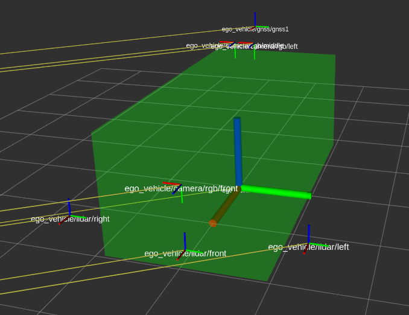
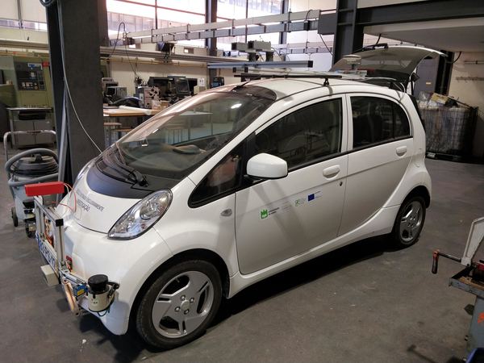

# Carla ROS Vehicle

This package provides two ROS nodes:

- Carla Example ROS Vehicle: A reference client for spawning an vehicle using ROS.
- Carla ROS Manual Control: a ROS-only manual control

## Carla Example ROS Vehicle

The reference Carla client `carla_example_ros_vehicle` can be used to spawn an ego vehicle (role-name: "ego_vehicle") with the following sensors attached to it.

- GNSS
- 3 LIDAR(front + left + right)
- Cameras (one front-camera + one middle-camera + one left-camera + one camera for visualization in carla_ros_manual_control)
- Collision Sensor
- Lane Invasion Sensor

Info: To be able to use carla_ros_manual_control a camera with role-name 'view' is required.

If no specific position is set, the vehicle is spawned at a random position.

### Spawning at specific position

It is possible to (re)spawn the vehicle at the specific location by publishing to `/initialpose`.

The preferred way of doing that is using RVIZ:

Selecting a Pose with '2D Pose Estimate' will delete the current ego_vehicle and respawn it at the specified position.

### Create your own sensor setup

To setup your own vehicle with sensors, follow a similar approach as in `carla_example_ros_vehicle` by subclassing from `CarlaRosVehicleBase`.

Define sensors with their attributes as described in the Carla Documentation about [Cameras and Sensors](https://github.com/carla-simulator/carla/blob/master/Docs/cameras_and_sensors.md).

The sensors attached to the ego vehicle can be defined via a json file `sensors.json`. The `carla_ros_vehicle` reads it from the file location defined via the private ros parameter `sensor_definition_file`.

The json format is defined like this:

    { 
        "sensors" = [
            {
              "type": "<SENSOR-TYPE>",
              "id": "<NAME>",
              "x": 0.0, "y": 0.0, "z": 0.0, "roll": 0.0, "pitch": 0.0, "yaw": 0.0, # pose of the sensor, relative to the vehicle
              <ADDITIONAL-SENSOR-ATTRIBUTES>
            },
            ...
        ]
    }

Define sensors with their attributes as described in the Carla Documentation about [Cameras and Sensors](https://github.com/carla-simulator/carla/blob/master/Docs/cameras_and_sensors.md).

An example is provided by [carla_example_ros_vehicle.launch](launch/carla_example_ros_vehicle.launch). It uses the sensors from [sensors.json](config/sensors.json)

### Image Results

ROS Vehicle Setup           |  ATLASCAR Vehicle Setup
:-------------------------:|:-------------------------:
  |  